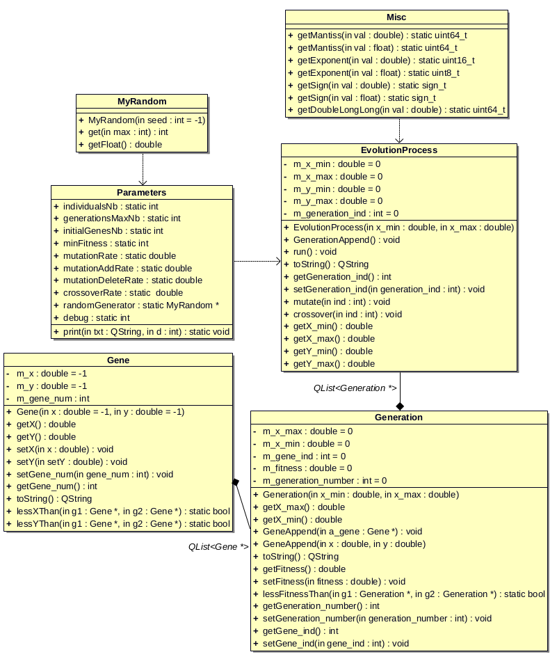
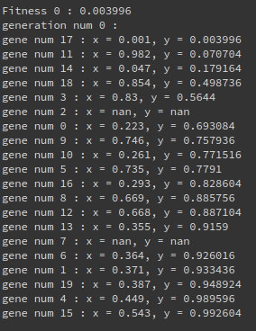
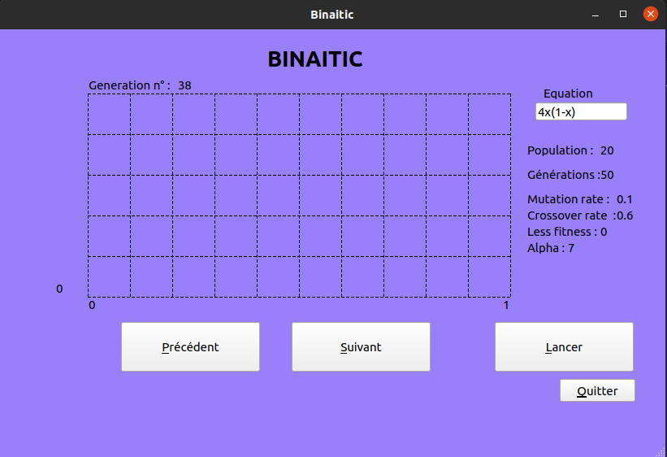
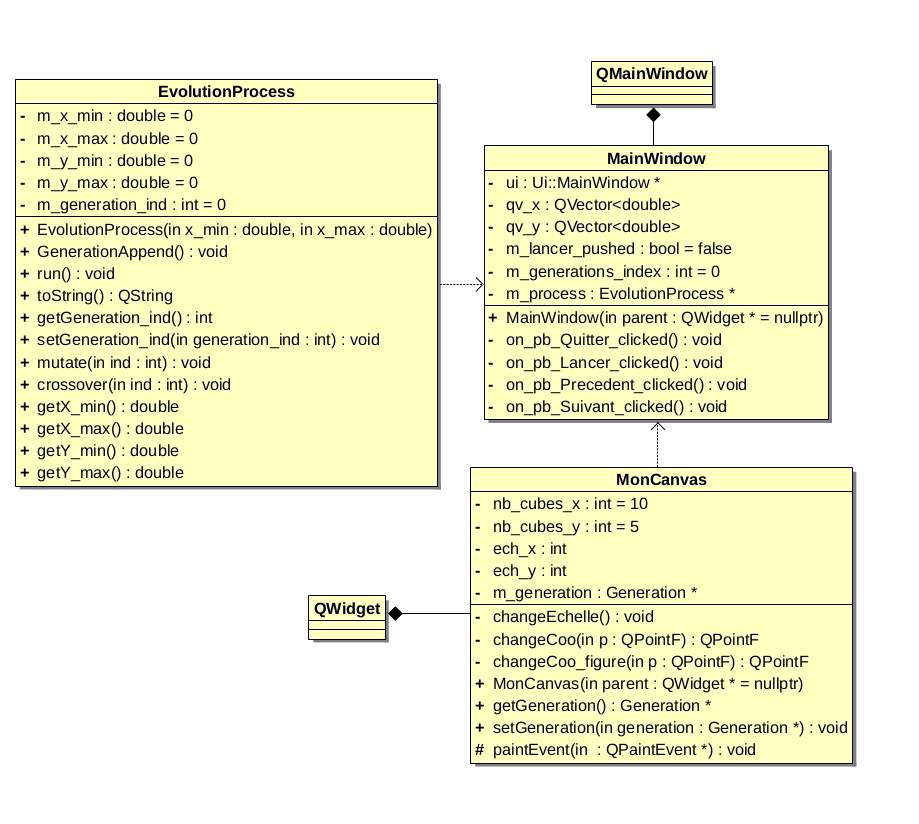
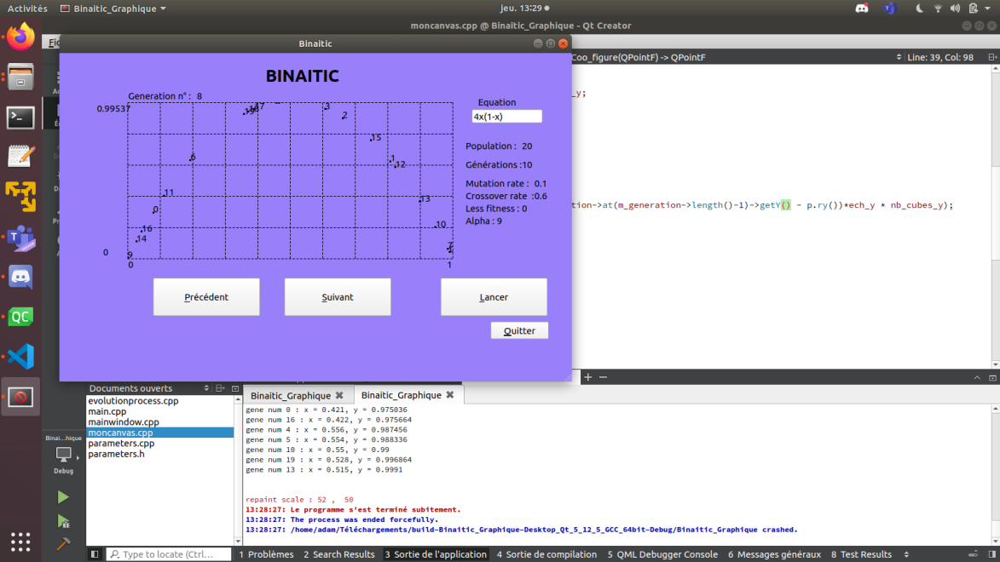

BERGER Jordan

LUCAS Adam

MAPET Yorick

https://github.com/joberger95/binaitic

# Projet Binaitic

Dans une optique d'amélioration des compétences de chacun des étudiants dans les domaines de la génétique et du développement C++, le projet sera basé sur:

- base de suivi: http://www.alliot.fr/fgenetic.html.fr
- logiciel de développement: QTCreator
- GitHub
- VsCode pour la rédaction du rapport MarkDown.

## Objectif

Un alogrithme génétique a pour but d'effectuer des optimisations dans un espace défini de données, résoudre un problème aux solutions inconnues dans un temps acceptables. 

Ici, l'étude d'une fonction aléatoire représentée par une courbe et composée d'une "population" basée sur la notion de sélection naturelle.

# Composition d'une génération et de ses individus

## Le gène

Un gène est formé d'une coordonnée en **x** ainsi que d'une coordonnée en **y**.

## Un individu

Chacun des individus est identifié par son gène et une valeur de fitness (ici, sa coordonnée **y**).

## Une génération

Une génération est composée d'un nombre défini d'individus.

```C++
    std::sort(a_generation->begin(), a_generation->end(), Gene::lessYThan);

    /*On stocke le fitness le plus bas dans une variable m_fitness pour en simplifier l'accessibilité*/

    a_generation->setFitness(a_generation->at(0)->getY());
```
# Processus de sélection et de mutation

## L'alpha et son fitness

L'individu désigné comme étant l'Alpha est celui dont le fitness est le plus bas.

```C++
bool Generation::lessFitnessThan(Generation *g1, Generation *g2)
{
    return g1->getFitness() < g2->getFitness();
}
```
## Le cross-fit

Valeur aléatoire permettant de scinder en deux parties le gène de deux individus. Ces dernières deviennent donc miscibles afin de former un nouveau gène. C'est la **sélection naturelle et aléatoire**. Ce processus est appliqué à toute la génération pour former la génération suivante.

```C++
    void EvolutionProcess::crossover(int ind)
{

    do_ch_t temp;
    do_ch_t temp_2;

    Gene *a_gene;

    Generation *a_generation = new Generation(m_x_min, m_x_max);
    a_generation->setGeneration_number(m_generation_ind);
    append(a_generation);
    m_generation_ind++;

    a_gene = new Gene(at(0)->at(0)->getX(), at(0)->at(0)->getY()); //insert first gene
    a_gene->setGene_num(at(0)->at(0)->getGene_num());
    a_generation->GeneAppend(a_gene);

    for (int i = 1; i < Parameters::initialGenesNb; i++) {

        temp._double = at(0)->at(i)->getX(); //X alfa
        temp_2._double = at(ind)->at(i)->getX(); //selected X

        if(Parameters::randomGenerator->getFloat() < Parameters::crossoverRate) {
            temp_2._long_long &= ~(uint64_t(pow(2, DOUBLE_EXP_OFFSET/1.2) - 1));
            temp_2._long_long |= temp._long_long & (uint64_t(pow(2, DOUBLE_EXP_OFFSET/1.2) - 1)); // modified selected X

            if (temp_2._double < 0)
                temp_2._long_long &= ~DOUBLE_SIGN_MASK;

            if(temp_2._double > 1)
                temp_2._long_long %= 2;
        }

        a_gene = new Gene(temp_2._double, FORMULA(temp_2._double));
        a_gene->setGene_num(at(ind)->at(i)->getGene_num());

        a_generation->append(a_gene);
        a_generation->setGene_ind(a_generation->getGene_ind() + 1);

        std::sort(a_generation->begin(), a_generation->end(), Gene::lessYThan);
    }
}
```
## La sélection des individus

L'Alpha est sélectionné par son fitness et rejoint automatiquement la génération n+1. Les individus, issus de la génération n-1, se voient donc un à un mélangés avec l'Alpha. L'individu généré, à l'aide du cross-fit, rejoint ensuite la génération n+1.

```C++
    std::sort(begin(), end(), Generation::lessFitnessThan);
```
## La mutation aléatoire

La mutation est dite aléatoire car mélange le gène de deux individus (cf: cross-fit).

```C++
    void EvolutionProcess::mutate(int ind)
{

    do_ch_t temp;
    int rand_offset;

    for (int i = 0; i < Parameters::initialGenesNb; i++) {
        if(Parameters::randomGenerator->getFloat() < Parameters::mutationRate) {

            rand_offset = Parameters::randomGenerator->get(DOUBLE_EXP_OFFSET - 1); // from 0 to 51 (mantiss lenght)

            temp._double = at(ind)->at(i)->getX();
            temp._long_long ^= (1<<rand_offset);

            if (temp._double < 0)
                temp._long_long &= ~DOUBLE_SIGN_MASK;

            if(temp._double > 1)
                temp._long_long %= 2;

            at(ind)->at(i)->setX(temp._double);

            at(ind)->at(i)->setY(FORMULA(temp._double));
        }
    }
}
```
## La nouvelle génération

La nouvelle génération est la résultante des mélanges effectués sur la génération n-1. Elle se verra elle aussi désigné son Alpha et subira les mêmes effets afin de créer la génération n+1.

```C++
    void EvolutionProcess::run()
{
    EvolutionProcess::GenerationAppend();
    for(int i = 0; i < Parameters::generationsMaxNb - 1; i++) {
        crossover(0);
        mutate(0);
    }
    std::sort(begin(), end(), Generation::lessFitnessThan);
}
```

## UML moteur

Ci-dessous, le diagramme UML du moteur du projet:




# Lecture graphique

En version console, on affiche le contenu d'une génération avec son fitness le plus bas et les coordonnées des gènes :



En version graphique:



L'interface permet:
- le lancement du moteur avec le bouton *Lancer*
- la navigation entre les générations grâce aux boutons *Précédent* et *Suivant*
- la visualisation de l'équation et d'autres informations liées aux moteur tel que la population, le nombre de génération ou les diverses informations liées aux calculs.
- enfin un bouton *Quitter* permet de fermer l'interface

## UML interface graphique

Le diagramme UML de l'interface graphique



# Problèmes rencontrés

L'interface graphique ne permet l'affichage de la courbe, le programme plante et la source de l'erreur n'a pas été déterminée. Il est possible de générer une courbe, mais qui survient de manière aléatoire dans l'exécution du code:



# Retour d'expérience

Ce projet a permis à l'équipe une progression et une appréhension saine de la génétique. Ainsi, les différents  sujets et termes liés à ce dernier sont alors mieux compris. De plus, cela a permis à l'ensemble des membres de progresser en programmation et notamment en progression orientée objet.